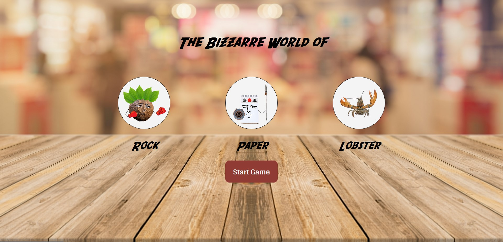

  <h1>Rock vs Paper vs Lobster</h1>

This is my version of the rock-paper-scissors project for [The Odin Project](https://www.theodinproject.com). The goal is to create a rock-paper-scissors with a focus on DOM manipulation and event listeners.

The game is straight-forward rock-paper-scissor except I threw in a lobster. I decided to go with an arcade game feel for this project.

I had a lot of fun working on this project.

Check out the project here: [Rock Paper Lobster](https://github.com/JoshDagat/rock-paper-lobster)

## Getting Started

---

I wanted to

